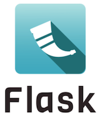
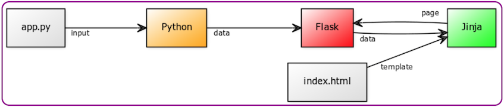
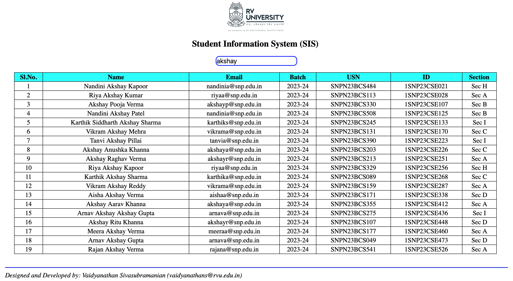

  </img>

# Full stack Web and Desktop app development with Flask
I am teaching Computer Science courses to 1st year under-grad students pursuing Bachelor of Technology.

One of the course is *_"Building Apps with Python"_*.  A course outcome is to equip students with knowledge of creating a minimalist web app and desktop apps (for Windows as well as Mac), with Python as the backend server-side coding language.  

Being a micro web framework with a built-in web server and with its capability to allow reuse of 99% of the codebase for creating a web app as well as desktop app (targeting both Windows and Mac), Flask is the ideal choice for this use case.

For developing desktop apps, the [FlaskWebGui](https://github.com/ClimenteA/flaskwebgui) package is used.

A representative architecture of a Flask app is as below:

  </img>

## App requirements
A simple app to search for and retrieve student(s) information like Name, Email, Batch, USN, ID, Section stored in a database and display in a table.  A wireframe is as below:

  </img>

## Software stack
- Python 3.9
- Flask 2.2.3
- Flask-Cors 3.0.10 (for managing [CORS](https://developer.mozilla.org/en-US/docs/Web/HTTP/CORS))
- Flaskwebgui 1.0.8
- SQLite3
- HTML, CSS, JavaScript, RESTful API

## Installation
- Python: https://www.python.org/downloads/
- Flask: pip3 install flask
- Flask-Cors: pip3 install flask_cors
- Flaskwebgui: pip3 install flaskwebgui
- SQLite3: https://www.sqlite.org/download.html

## Source Code
The [source](https://github.com/svaidyans/Flask/tree/main/source) folder contains all the source code.

## Running
### Web App
- From a Terminal (Mac) or Command Prompt (Windows) run "python3 flask_webapp_demo.py"
- Open "index.html" in a browser tab

### Mac/Windows App
- From a Terminal (Mac) or Command Prompt (Windows) run "python3 flask_webgui_demo.py"
- This will automatically open a desktop window with the front-end HTML code

## Desktop Apps
Another advantage of developing a desktop app with Flask (using package FlaskWebGui) is that it just spawns a new flask server thread with a browser, making the app a [PWA](https://developer.mozilla.org/en-US/docs/Web/Progressive_web_apps) with just 2 additional lines of code!  

To create an installer app (Mac) or exe (Windows) use [Pyinstaller](https://pyinstaller.org/en/stable/).

The already precompiled desktop apps zip file is available in the [dapps](https://github.com/svaidyans/Flask/tree/main/dapps) folder.  

