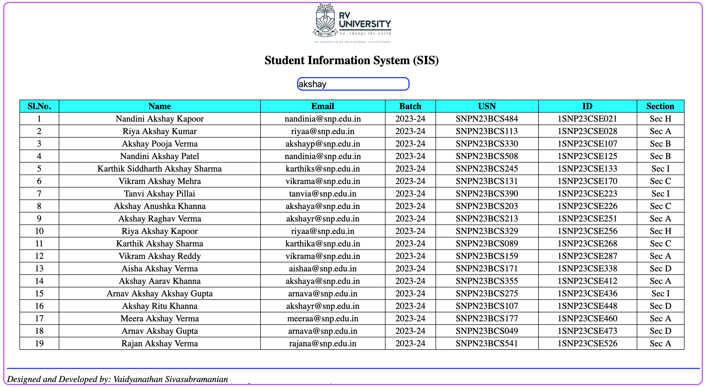

  </img>

# Full stack Web and Desktop app development with Flask

## Introduction
I am teaching **"Building Apps with Python"** course to 1st year under-grad students pursuing Bachelor of Technology in Computer Science and Engineering.  

One of the course outcome is to equip students with knowledge of creating a minimalist web app and a desktop app.  Being a micro web framework with built-in web server and with its capability to allow reuse of 99% of the codebase for creating a web app as well as desktop app (targeting both Windows and Mac), Flask is the ideal choice.

## App requirements
The intention is search for and retrieve student(s) information like Name, Email, Batch, USN, ID, Section stored in a database and display in a table.  A wireframe is as below:

  </img>

## Software stack
- Python 3.9
- Flask 2.2.3
- Flask-Cors 3.0.10
- flaskwebgui 1.0.8
- SQLite3
- HTML, CSS, XMLHttpRequest 
